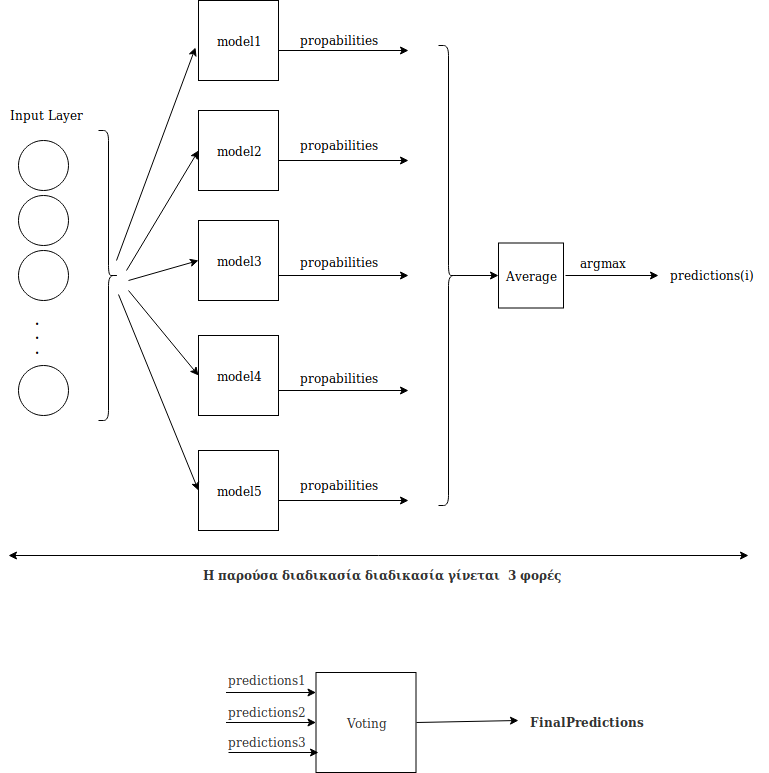

# Supervised Learning - Multiclass classification problem: Build a classifier to predict the number of passengers in flights

### [**Contents**](#)
1. [Project Description](#descr)
2. [Data set Description](#dataset)
3. [Implementation Process](#Impl)
4. [Team](#Team)

### [**Project Description**](#) 

The aim of this project was to apply various data preprocessing techniques and machine learning algorithms and evaluate the performance of these algorithms on a data set regarding flights. In particular, a set of data which consists of several thousand flights to America was given, where each flight is described by a set of variables (airport of departure, airport of arrival, etc.). Each flight is also characterized by a variable related to the number of passengers on the flight (e.g. each value of the variable is related to a range of passenger numbers). For some flights, the value of the variable is known, while for others it is not. The goal was to predict the value of the variable for flights for which it is not available.

The project was implemented in the context of the course "Data Science & Web Mining" taught by Prof. Vazirgiannis Michalis in the Department of Informatics (AUEB) and it was part of the following **Kaggle** competition: [INF131: The case of flight passengers prediction](https://www.kaggle.com/c/inf131-data-mining/overview/description).

### [**Data Set Description**](#) 

The files we examined are the following:

- train.csv - 8,899 labeled flights. One flight and label per row.
- test.csv - 2,229 flights. One flight per row.

The file named "train.csv" contains the training data of the problem, while the file "test.csv" contains the test set of the problem. Each line of these two files corresponds to a flight, which is characterized by the following variables:

- **DateOfDeparture:** Departure date of the flight (*object*)
- **Departure:** Code of the departure airport (*object*)
- **CityDeparture:** Name of the departure airport (*object*)
- **LongitudeDeparture:** Longitude of the departure airport (*float64*)
- **LatitudeDeparture:** Latitude of the departure airport (*float64*)
- **Arrival:** Code of the arrival airport (*object*)
- **CityArrival:** Name of the arrival airport (*object*)
- **LongitudeArrival:** Longitude of the arrival airport (*float64*)
- **LatitudeArrival:** Latitude of the arrival airport (*float64*)
- **WeeksToDeparture:** How many weeks before departure did passengers on average book their tickets (*float64*)
- **std_wtd:** Standard deviation for the "WeeksToDeparture" variable (*float64*)

The training set contains the additional variable **PAX** (*int64*), which is related to the number of passengers on the flight. This variable takes 8 different values, i.e., values from 0 to 7, so 8 categories in total. Each category indicates the range of passengers boarding the flight. However, the numbers in the categories are randomly assigned. The variable PAX is missing from the test set, as it is the variable that had to be predicted in the context of this assignment.

### [**Implementation Process**](#) 

#### Data Preprocessing Techniques:

- Feature creation
- Min-max normalization
- One-hot-encoding for object variables
- Principal components analysis for feature extraction

#### Machine Learning Algorithms:

- Decision tree classifier
- K-nearest neighbors algorithm
- Gradient Boosting classifier
- Neural Networks

#### Fine-tuning of Hyperparameters:

- Number of estimators, max_depth, and learning rate for Gradient Boosting classifier
- Number of neighbors, and the algorithm used to compute the nearest neighbors for K-nearest neighbors classifier
- Hidden layer sizes, activations, optimizers, weight initializers, number of epochs, dropout regularization, and learning rate for Neural Networks

#### Proposed Model:

### [**Team**](#) 

- [Dimitris Staratzis](https://github.com/DimitrisStaratzis)
- [Stratos Xenouleas](https://github.com/Essex97)
- [Chryssa Nampouri](https://github.com/ChryssaNab)
